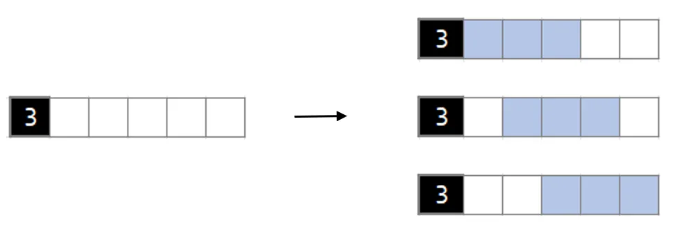

#
### CI5437 - Inteligencia Artificial 1
##### Prof. Carlos Infante

# Proyecto 4

<div style='text-align: right;'>
Por <a href='https://www.github.com/chrischriscris'>Chus</a> | <a href='https://www.github.com/fungikami'>K</a>
</div>

## 1. Introducción

Un nonograma, también llamado como Hanjie, Picross o Griddlers, es un tipo de rompecabezas lógico que consiste en una cuadrícula, no necesariamente rectangular, en la que algunos de los cuadrados están sombreados. El objetivo del rompecabezas es sombrear los cuadrados restantes de tal manera que cada columna y cada fila contenga el número de cuadrados sombreados especificado en la parte superior o izquierda del rompecabezas.

Los nonogramas son un rompecabezas relativamente nuevo, que se originó en Japón en la década de 1980. Desde entonces, se han vuelto populares en todo el mundo, contando con juegos de consola, en línea y apareciendo en numerosas revistas de rompecabezas. Con el tiempo, incluso se han desarrollado variantes, las cuales incluyen la adición de colores, la eliminación de pistas o la adición de dimensiones (e.g. Picross 3D).

En el siguiente proyecto se busca resolver un nonograma en su variación monocromática bidimensional con todas las pistas, utilizando uno de los métodos de inteligencia artificial vistos en clase. Para ello, se traducirá el problema a una instancia de SAT, para luego resolverlo utilizando el programa `glucose`.

## 2. Detalles de implementación

### 2.1. Representación del problema

Para representar el problema, se comenzó generando una variable por cada celda de la cuadrícula, con el siguiente formato:

$x_{ij}$: Variable que representa si la celda en la fila $i$ y columna $j$ está sombreada, donde $1 \leq i \leq n$ y $1 \leq j \leq m$

### 2.2 Traducción del problema

El acercamiento que se tomó para representar las pistas fue el siguiente:

- Para cada pista, se utilizó teoría combinatoria para generar todas las posibles combinaciones de celdas sombreadas que cumplieran con la pista dada para la fila o columna.

- Con esto, una posible combinación de celdas sombreadas tiene la forma $l_1 \land l_2 \land \dots \land l_k$, donde cada $l_i$ son los literales de una misma fila o columna en una combinación que están o no sombreados, siendo $k = m$ si la pista es para una fila y $k = n$ si la pista es para una columna.

- Luego, cada combinación posible se une con disyunciones para representar que una de ellas debe ser cierta para que se cumpla la pista.

Ejemplo:



Se traduce a:

$(x_{11} \land x_{12} \land x_{13} \land \neg x_{14} \land \neg x_{15}) \lor (\neg x_{11} \land x_{12} \land x_{13} \land x_{14} \land \neg x_{15}) \lor (\neg x_{11} \land \neg x_{12} \land x_{13} \land x_{14} \land x_{15})$

El problema con esta representación es que cada pista está en una forma disyuntiva normal (DNF), y al momento de distribuir $\land$ sobre $\lor$ se produce una explosión combinatoria de cláusulas que hace que crezca el tamaño de la CNF de forma exponencial (por ejemplo, para el ejemplo de arriba se generan 5^3 = 125 cláusulas).

Por esto, se decidió utilizar la transformación de Tseitin, con el que se introducen variables auxiliares para generar una instancia de CNF equisatisfacible a la vez que se mantiene el tamaño de la CNF en un orden polinomial. La tranformación de Tseitin se hace de la siguiente manera:

- Por cada posible combinación se añade una variable auxiliar $p_i$ que representa si la combinación es cierta o no.

- Se añade en conjunción la definición de la variable auxiliar $p_i$: $p_i \leftrightarrow (l_1 \land l_2 \land \dots \land l_k)$, lo cual equivale a ―usando las definiciones de equivalencia e implicación: $(\neg p_i \lor (l_1 \land l_2 \land \dots \land l_k)) \land (\neg(l_1 \land l_2 \land \dots \land l_k) \lor \neg p_i)$.

- Se desarrolla para obtener: $(\neg p_i \lor l_1) \land (\neg p_i \lor l_2) \land \dots \land (\neg p_i \lor l_k) \land (p_i \lor \neg l_1 \lor \neg l_2 \lor \dots \lor \neg l_k)$.

De esta manera, para el ejemplo anterior se tendría:

$(p_1 \lor p_2 \lor p_3) \land (p_1 \leftrightarrow (x_{11} \land x_{12} \land x_{13} \land \neg x_{14} \land \neg x_{15})) \land (p_2 \leftrightarrow (\neg x_{11} \land x_{12} \land x_{13} \land x_{14} \land \neg x_{15})) \land (p_3 \leftrightarrow (\neg x_{11} \land \neg x_{12} \land x_{13} \land x_{14} \land x_{15}))$

Lo cual, luego de desarrollar resulta en 19 cláusulas, a diferencia de las 125 que se generan al distribuir $\land$ sobre $\lor$.

En particular, el número de variables auxiliares que se generan es igual a la suma de la cantidad de posibles combinaciones que satisfacen cada pista para cada fila y columna, el cual, por estar basado en combinaciones, resulta crecer asintóticamente de forma factorial.

Veamos pues que el número de combinaciones posibles se reduce a un problema de escoger $l$ bloques de un conjunto de $k$, donde $l$ es el número de elementos de la pista (la lista de números que aparece a la izquierda de una fila o encima de una columna), y $k$ es el número total de lugares donde se pueden colocar los bloques, que es igual al número de celdas de la fila o columna, menos la suma de los elementos de la pista más uno (esto último es para dejar un espacio entre cada bloque).

Para el ejemplo anterior, la primera fila tiene longitud 5 y la pista es `[3]`, por lo que $l = 1$ y $k = 5 - 3 + 1 = 3$. Así, el número de combinaciones posibles es igual a $\binom{3}{1} = 3$.

De esta forma, se tiene que una expresión general para calcular el número de posibilidades para la fila $i$ es, sea $PF_i$ la lista pista de la fila $i$ y $PC_j$ la lista pista de la columna $j$:

$$n\_pos\_fila_i = \binom{m + 1 - \sum_{j=1}^{PF_i.size} P_i[j]}{PF_i.size}$$

Y para la columna $j$:

$$n\_pos\_col_j = \binom{n + 1 - \sum_{i=1}^{PC_j.size} P_j[i]}{PC_j.size}$$

Así, el número total de variables auxiliares que se generan es:

$$n\_vars = \sum_{i=1}^{n} n\_pos\_col_i + \sum_{j=1}^{m} n\_pos\_fila_j$$

Por lo que el número total de variables resulta ser $n \times m + n\_vars$.

<!--
(p1 v p2 v ... v pn_pos_fila_i) ^ + 1

Posibilidad 1:
(-p1 v (l1 ^ l2 ^ ... ^ lk)) ^ + ncol
(p1 v -l1 v -l2 v ... v  -lk)) ^ + 1
.
.
.
Posibilidad n:
(-pn_pos_fila_i v (l1 ^ l2 ^ ... ^ lk)) ^ + ncol
(pn_pos_fila_i v -l1 v -l2 v ... v  -lk)) ^ + 1
-->

Finalmente, las expresiones para el número de cláusulas a generar para la fila $i$ tras la transformación de Tseitin es:

$$n\_claus\_fila_i = 1 + n\_pos\_fila_i * (m + 1)$$

Y para la columna $j$:

$$n\_claus\_col_i = 1 + n\_pos\_col_i * (n + 1)$$

Por lo que el número total de cláusulas resulta ser:

$$n\_claus = \sum_{i=1}^{n} n\_claus\_fila_i + \sum_{j=1}^{m} n\_claus\_col_j$$

### 2.3 Glucose Solver

Tras la traducción del problema en un caso de SAT, se procedió a ejecutar el programa `glucose`, en su versión 4.2.1, para resolver el problema.

### 2.3 Otras consideraciones

Gracias a que en el proyecto anterior se obtuvo el resultado de que un gran cuello de botella era guardar la CNF en memoria antes de escribirla, se decidió en este proyecto escribir la CNF directamente a un archivo, sin embargo, la entrada en formato DIMACS para `glucose` requiere que se indique el número de variables y cláusulas generado al comienzo, lo cual era un cálculo muy complicado de hacer antes de generar las cláusulas y de forma razonablemente eficiente.

A pesar de que la solución inmediata a este problema era generar la CNF en memoria, se decidió utilizar un enfoque diferente, el cual consiste en contar las variables y cláusulas que se van generando a medida que se escribe la CNF al archivo, y luego, al final, escribir en otro archivo solamente la cabecera del formato DIMACS con el número de variables y cláusulas contados.

Esto no genera un gran impacto en los tiempos de ejecución, ya que el archivo no se escribe dos veces (es decir, no se vuelven a escribir todas las cláusulas para hacer _prepend_ de la cabecera), sino que al pasar el archivo a `glucose` se concatenan los dos archivos in-place con el comando `cat` y mediante una pipe se hace que `glucose` lea de la entrada estándar, que empieza a leer del segundo archivo al terminar el primero:

```bash
cat <header_file> <cnf_file> | glucose /dev/stdin
```

## 3. Resultados experimentales

#### 3.1 Entorno de pruebas
Para la ejecución del programa se utilizó un computador con las siguientes características:

- **Procesador**: Intel i5-1035G1 (8) @ 3.600GHz.
- **Memoria RAM**: 7689MiB.
- **Almacenamiento**: SSD M.2, Max Sequential Write 1000MB/s.
- **Sistema operativo**: Pop!_OS 22.04 LTS x86_64.

### 3.2 Casos de prueba

Se tomaron distintos casos de prueba de la página web [Web Paint-by-Number](https://webpbn.com/). Por ejemplo, se pueden tomar algún caso de prueba de `Random Puzzle`, seleccionar un caso monocromático y tomar el ID del problema (e.g. Web Paint-By-Number Puzzle #335). Luego, se puede utilizar el siguiente comando para descargar el problema:

```bash
wget -qO- https://webpbn.com/export.cgi --post-data "id=<problem_id>0&fmt=nin&go=1" > <out_filename>
```

### 3.3 Ejecuciones

| Test        | Dimensiones | # Variables |  # Cláusulas  | Tiempo DIMACS (s) | Tiempo Solución SAT (s) | Tiempo Total (s) | Tamaño CNF (MB) |
| :---------: | :---------: | :---------: | :-----------: | :---------------: | :---------------------: | :--------------: | :-------------: |
| `test0.txt` | 25x30       | 109702      | 3314547       | 3.475586649       | 3.219199434             | 6.694786083      | 58.5            |
| `test1.txt` | 53x53       | 9232039     | 498378526     | 689.1919289       | RIP Memoria             | -                | 10700           |
| `test2.txt` | 5x1         | 13          | 34            | 0.000236264       | 0.403601745             | 0.403837009      | 0.000272        |
| `test3.txt` | 15x1        | 40          | 206           | 0.000915377       | 0.403540769             | 0.404456146      | 0.0022          |
| `test4.txt` | 35x35       | 626578      | 22512778      | 21.376842189      | 9.254196741             | 30.63103893      | 432.9           |
| `test5.txt` | 35x40       | 3944        | 97109         | 0.085255943       | 0.403458171             | 0.488714114      | 1.7             |
| `test6.txt` | 20x30       | 183192      | 5392102       | 5.374969692       | 3.621802678             | 8.99677237       | 96.9            |
| `test7.txt` | 25x25       | 109702      | 3314547       | 0.909934861       | 1.207707478             | 6.694786083      | 16.2            |


### 3.4 Análisis de los resultados

Se puede observar que el número de variables y de cláusulas dependen en gran medida de la instancia en particular, dado que éstas se generan según el número de posibilidades que se tiene de configuraciones válidas para cada pista. Ejemplo de ello, es el test5, que a pesar ser 35x40, no tiene muchas posibles configuraciones válidas dado que tiene numeros casillas ya sombreadas, por lo que el número de variables y cláusulas es bajo. En cambio, el test4, de dimensiones similares, tiene un número de variables y cláusulas mucho mayor, debido a que tiene muchas más posibilidades de configuraciones válidas.

Asimismo, la solución propuesta logra solucionar casos pequeños, medianos y grandes. Sin embargo, para casos muy grandes, como el test1, se tiene que el archivo DIMACS generado es de 10.7GB, y a su vez, el programa `glucose` no logra resolverlo, ya que se queda sin memoria.


## 4. Conclusiones y recomendaciones

- En este proyecto se logró resolver un nonograma utilizando un SAT solver, el cual se tradujo a una instancia de SAT utilizando la transformación de Tseitin. Asimismo, se logró resolver casos pequeños, medianos y grandes, sin embargo, para casos muy grandes, se tiene que el programa `glucose` no logra resolverlo, ya que se queda sin memoria.

- Para futuros proyectos, se puede realizar por encima del computo de casos posibles, el empleo de alguna heurística que permita reducir el número de combinaciones posibles, y así, reducir el número de variables y cláusulas generadas. Esto permitiría resolver casos muchos más grandes, y a su vez, reducir el tiempo de ejecución.

